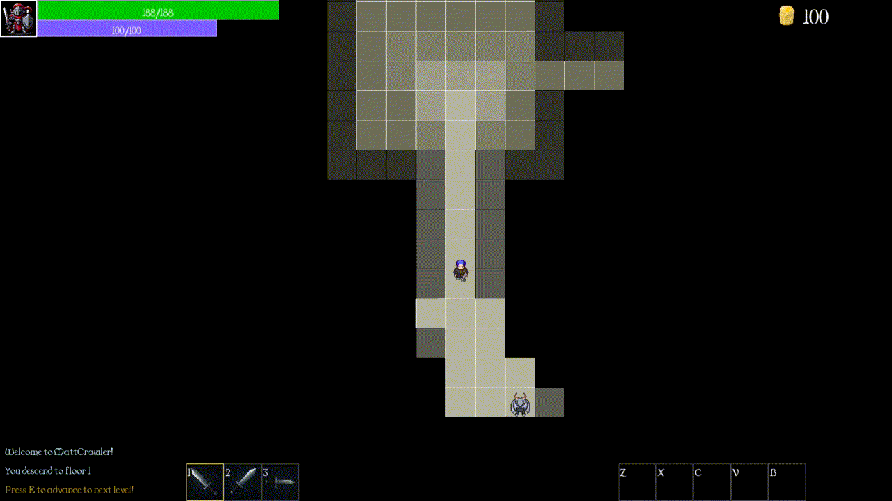

# Matheo Crawler
Matheo Crawler, is a 2D dungeon game, written used C++20 and SFML 3.0;
The project, is developed as part of portfolio, but might serve as a source of entertainment or inspiration for others.
It was designed and programmed solely by one person.
<table>
  <tr>
    <td align="center">YouTube</td>
    <td align="center">GIF1</td>
    <td align="center">GIF2</td>
  </tr>
  <tr>
    <td>
      
    </td>
    <td>
      
    </td>
    <td>
      
    </td>
  </tr>
</table>

# Features
I have developed a few different algorithms and techniques to better my skills and enrich the gameplay, such as:
  - Map generated procedurally using BSP
  - Pathfinding with A* algorithm
  - Recursive shadowcasting for visibility
  - Handling different states like Menu/Game State/Options, etc.. with State Pattern
  - Composite Pattern ("cheap ECS") used for architecture
  - Basic AI for monsters
  - Spell System
  - Upgradeable attributes and attack types.

Since the map is generated by code, i aimed to make the gameplay as long as user would like to play. That means, the player can upgrade his:
  - attributes (5 different)
  - blade arts (3 different types of attack)
  - spells (12 different spells in 3 types of categories).

# AI
AI helped build this project! Even tho, most of the code is written by me personally, Artificial Intelligence has assisted me with RGB colors (most of the colors in code are generated by AI) as well as naming conventionts. 
In addition, i have used many AI-generated graphics for the project, made by ChatGPT, Gemini and Microsoft Designer. I am very thankfull to every developer of those systems, as it helps me create a visually pleasant content and push my project forward.

# Building from source
The project uses **CMake** for easy building and dependency fetching

## Requirements:
  - Compiler supporting C++20
  - Installed [CMake](https://cmake.org/)
  - Installed [Git](https://git-scm.com/downloads) - required to fetch the SFML library
  - If you are using linux, you also need other dependencies that the SFML uses. Click [here](https://www.sfml-dev.org/tutorials/3.0/getting-started/build-from-source/#installing-dependencies) and [here](https://github.com/SFML/cmake-sfml-project?tab=readme-ov-file#command-line)  for more information.

## Build Instructions:
  1. Open command terminal (**cmd**)
  2. Navigate to where you want to clone the project (**cd C:/Projects**)
  3. Clone the repository (**git clone https://github.com/matheoheo/MatheoCrawler.git**)
  4. Enter the project folder (**cd MatheoCrawler**)
  5. Configure the build with CMake (**cmake -S . -B build**)
  6. Build in Debug (**cmake --build build --config Debug**) or Release (**cmake --build build --config Release**) mode.
     
The .exe files will be found at (**/build/bin/Debug**) or (**/build/bin/Release**).

# How To Play
The game is extremely easy to understand. After opening the application, all you have to do is just press Start New Game. It will load in very quick moment and you can enjoy your experience!

# Controls
The project comes with built-in control options, such as:
  - WSAD keys for moving the player;
  - 'M' key opens and closes Shop;
  - '1'/'2'/'3' store different types of attacks. The order can not be changed;
  - 'Z'/'X'/'C'/'V'/'B' are used for spells actions. Those can be assigned to each key from Shop;
  - 'E' is used for advancing to the next level, while standing on Advance Tile.

# Options
User can change following settings from the Options menu:
  - Resolution,
  - Fullscreen mode
  - Virtual Synchronization
  - Anti-aliasing level.

The controls are fixed and can not be changed.

# Goal
The goal is very simple. Just play until you get bored, then take a break and come back :). In all seriouness, Your goal is to advance to the highest level possible - there is no campaing mode, you just play and push forward, this is never ending. User has an option to upgrade exactly 20 progression points that are made for this exact scenario.
There is no saving state - if you die, or quit, it all gets resetted and you start from 0 the next time you come back.

# Audio
This game comes without any audio, any sound effects. You enjoy your personal music that fits your taste as you are playing.

# Credits
Full credits and acknowledgments can be found in the game's in game **Credits** menu.

# Potential Additions
- [] More monster types with unique abilities.
- [] In game tutorial while playing.

